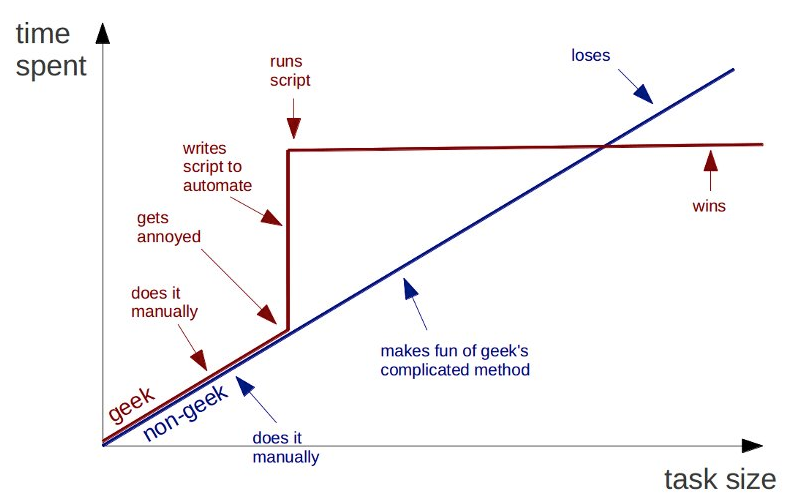

Python for Scientists
=====================

---

Introduction
------------

### Class Objectives

1. You will understand how scripting languages fit into the toolbox of
a computational scientist.
2. You will see why python is a powerful choice

This introduction is an adaptation of the introduction of *Python
Scripting for Computational Science* by Hans Petter Langtangen.

---

Scripting vs Traditional programming
------------------------------------

In traditional programming, large applications are typically
written at a low level. Scripting by contrast is programming at a
very high level with flexible languages. 

> Traditional programming: fortran, c, c++, c#, java
>
> Scripting: python, perl, ruby, (matlab)

A major thrust of scripting is that you can automate many tasks
that otherwise you would do by hand.

---

Has this ever happened to you?
------------------------------

### Scene 1
You are working on data for a presentation your advisor is giving
at a conference. At the last minute, you realize that there is a
major bug in your code and you need to regenerate all the images
and graphs that you have given him. You spend 30 minutes
regenerating the data and 6 hours regenerating the graphs because
you had them in Excel and had done them by hand.

### Scene 2
You are working on your thesis and as you near the finish you
review some graphs you generated months earlier and you aren't
sure if they are now completely up to date. You spend half a day
locating the old code that you wrote on your second laptop and
hours more again creating and polishing the charts.

---

Buyer Beware
------------

Learning to automate many of these common tasks can greatly
increase your productivity (and make your research
reproducible). However, beware that there is no end to the number
of different ways to do essentially the same thing. 

---

Why scripting is useful
-----------------------

There are perhaps many reasons, here we list a few:

* scripting languages have nicer interfaces
* allow you to build your own work environment
* scientific computing is more than crunching numbers
* easier creation of GUIs and demos
* create modern interfaces to old codes
* allow you test interactively
* cleaner, shorter, easy to read code

---

Is Python > Matlab?
-------------------

### Similarities

* no vairable declaration
* simple and easy to use syntax
* easy creation of GUIs
* merges simulation and visualization

### Differences

* Python was designed to be completely open and to be integrated with external tools
* A Python module may contain a lot of functions and classes (compared to many m-files)
* Object-oriented programming is more convenient
* Interfacing C,C++,Fortran is better supported
* scalar functions typically work with array arguments without changes to the arithmetic operators
* Python is FREE and runs on most any platform

---

The right tool for the job
--------------------------

Many times people are looking for an easy way out. Scripting is
easier to use, but not well suited for every situation. How do
you know which tool is right for the job?

### Traditional programming

* Does the application implement complex algorithms and/or data structures where low level control of implementation details is critical? 
* Does the application manipulate large datasets and thus the memory has to be carefully controlled?
* Are you not likely to be changing the code once it is programmed?

### Scripting

* Your application's main task is to connected existing components
* The application depends on manipulating text
* The design of the application is expected to change over its life
* The CPU-intensive parts of your application may be migrated to C or Fortran
* Your application is largely based on common objects found in computer science

---

Some Sample Applications
========================

---

Teaching the finite element method
----------------------------------

### Stiffness matrix computation

---

Monitor program progress
------------------------

### Python parses a datafile and makes plots of current progress

---

Problem prototypes
------------------

### Nonlinear, time dependent problem

---

Problem prototypes
------------------

### Method for fitting surface to data

---

Structural program
------------------

### Python manages floors and columns

---

Auto-generation of results
--------------------------

### Python runs my c-code, post-processes the results, and generates the latex table

---

Beginner's Guide
================

---

Script 1
--------

    #!/usr/bin/env python
    import sys,math
    try:
        r = float(sys.argv[1])
    except:
        print "No value specified"
        sys.exit()
    s = math.sin(r)
    print "Hello world, sin(%f)=%f" % (r,s)

---

Script 2
--------

    #!/usr/bin/env python
    import sys,math
    try:
        r = float(sys.argv[1])
    except:
        print "No value specified"
        sys.exit()
    s = math.sin(r)
    print "Hello world, sin(%f)=%f" % (r,s)

---